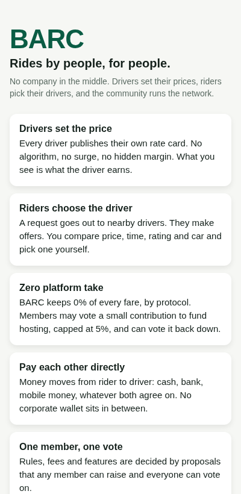
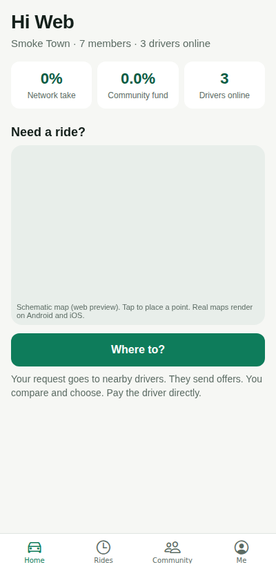
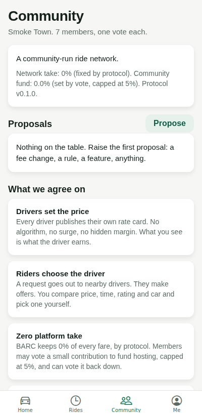
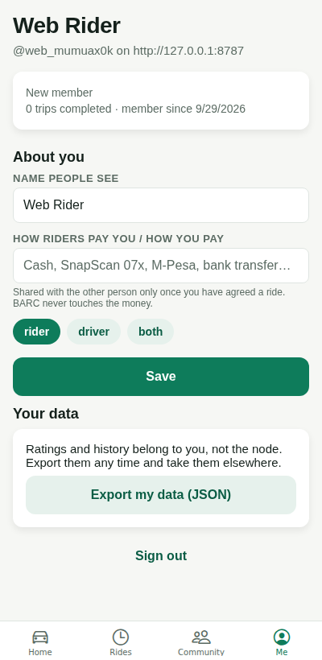

# BARC — rides by people, for people

BARC is an open-source ride-hailing app for **Android and iOS** built on one
principle: the people who drive and the people who ride own the network.
There is no company in the middle setting prices, taking a cut, or deciding
who gets work.

| Uber-style platform | BARC |
| --- | --- |
| Company sets the fare and applies surge | **Drivers publish their own rate card**; no surge, ever |
| Company assigns the driver | **Riders see every offer and choose** the driver themselves |
| 25–40% commission | **0% network take, fixed by protocol**. Members may vote a hosting contribution, capped at 5% |
| Money flows through the company's wallet | **Rider pays driver directly** (cash, bank, mobile money, whatever they agree) |
| Rules decided at head office | **One member, one vote** on proposals any member can raise |
| Ratings locked in the platform | **Your reputation is yours**: export it as JSON and take it to another node |
| One global server owned by one company | **Anyone can run a node**: a town, a taxi association, a group of friends |

<p>
  
  
  
  
</p>

## What's in the box

```
apps/mobile      Expo (React Native) app for Android and iOS, with a web preview
apps/server      The "node": a small self-hostable coordination server (Fastify + SQLite)
packages/shared  Types, fare maths and the protocol constants both sides agree on
```

**The app** has four tabs. *Home* shows the node's stats (take rate is always
0%) and either a rider's "Where to?" map or a driver's online switch and
nearby requests. *Rides* is your history. *Community* is governance:
proposals, votes, and the principles. *Me* is your profile, rate card, car,
payment handle and data export.

**The ride flow**: a rider sets pickup and drop-off, sees what nearby drivers'
rate cards would charge, and posts a request. Every online driver in range is
notified over WebSocket and can send an offer (their price, their ETA, a
message). Offers appear live on the rider's screen, cheapest first, with the
driver's rating and car. The rider chooses one. The driver's live position is
shared with the rider until the trip completes, then both rate each other
and settle payment directly.

**The node** is about 700 lines of TypeScript with a single SQLite file as
its whole state. No cloud services, no API keys, no third-party accounts.

## Run it

Requirements: Node 22.13 or newer, and the Expo Go app on your phone (or a
simulator).

```bash
npm install

# 1. Start a node
npm run server                      # http://localhost:8787

# 2. (optional) put three demo drivers online near you
npm run seed --workspace apps/server -- --lat -33.92 --lng 18.42

# 3. Start the app
npm run mobile                      # scan the QR code with Expo Go
```

On a physical phone, `localhost` is the phone itself. Put your computer's
LAN address in the app's *Node address* field when you join (for example
`http://192.168.1.20:8787`), or set `EXPO_PUBLIC_NODE_URL` before starting.

Two phones are the best demo: join one as a rider and one as a driver on
the same node, put the driver online, and request a ride.

### Maps

iOS uses Apple Maps with no key. Android uses Google Maps and needs a key in
`apps/mobile/app.json` under `android.config.googleMaps.apiKey`. Everything
else works without it; the map just renders blank on Android until the key
is set. The web preview draws a schematic map instead.

### Building the real apps

`react-native-maps` and `expo-location` include native code, so for store
builds use a development build or EAS:

```bash
cd apps/mobile
npx eas-cli@latest build --profile preview --platform android   # APK for testing
npx eas-cli@latest build --profile production --platform all    # store builds
```

Set `EXPO_PUBLIC_NODE_URL` in `eas.json` to your community's node address
so members don't have to type it.

### Hosting a node

```bash
cp apps/server/.env.example apps/server/.env    # name your node, pick a currency
npm start --workspace apps/server
```

Or with Docker: `docker build -f apps/server/Dockerfile -t barc-node . && docker run -p 8787:8787 -v barc-data:/data barc-node`.

Put it behind HTTPS (Caddy or nginx) and share the address with your
members. Back up the one `.db` file and you have backed up the node.

## Checks

```bash
npm run typecheck    # all workspaces
npm test             # shared fare/geo tests + server end-to-end flow
```

## Protocol, briefly

The constants in `packages/shared/src/protocol.ts` are the constitution:

- `NETWORK_TAKE_RATE = 0` — a node that keeps a cut is not a BARC node.
- `MAX_COMMUNITY_CONTRIBUTION_RATE = 0.05` — members may vote a hosting
  contribution, and can never be quietly turned into a platform fee.
- Fare = driver's base + per-km + per-minute, floored at the driver's minimum.
  There is no multiplier and no margin in `computeFare`.
- Riders choose; the node never assigns a driver.
- Trip progress (arrived, started, completed) is the driver's call; either
  side may cancel before the trip starts; ratings are mutual and one-shot.

## Honest limits of this first version

- **Identity** is a bearer token issued at sign-up. That is enough for a
  trusted community; a public node should add phone verification or
  in-person vetting. The hook is `apps/server/src/auth.ts`.
- **Distance and time** are estimated from straight-line distance with a
  detour factor, not a routing engine. Offers carry the real price, so the
  estimate only needs to be in the right ballpark.
- **Payments** are deliberately out of scope: the app shows the other
  person's payment handle and the agreed amount, and stays out of the way.
- **Federation** between nodes (taking a reputation export and importing it
  elsewhere) is exposed as an export today; import is the natural next step.

## License

MIT. Fork it, run it, change the rules with your members.
