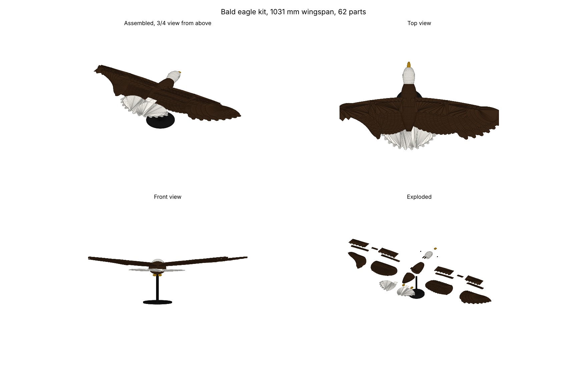

# Eagle kit (v0.1, engineering base)

A soaring eagle, ~1.03 m wingspan, split into 62 parts that each fit a 256 mm Bambu bed,
with four filament colours, dowel body joints and filament-pin feather joints. Generated
entirely by `eagle_kit.py`; change a number, re-run, and every STL, the Bambu 3MF, the
viewer GLB, the part list and the preview regenerate in about 20 seconds.

This is an **engineering base**, not a finished product: the body and head are smooth
procedural lofts and the feathers are flat plates. It proves the pipeline (geometry,
segmentation, joints, colour assignment, Bambu project file). The sculpted surface detail
that makes a kit sell comes next (see "Road to a sellable kit").



## Files

| Path | What |
| --- | --- |
| `eagle_kit.py` | Parametric generator (trimesh + manifold3d + shapely) |
| `bambu3mf.py` | Writer for Bambu Studio project files (one object per part, filament per object) |
| `out/stl/*.stl` | 62 binary STLs, each already laid flat for printing |
| `out/eagle_kit_bambu.3mf` | Bambu Studio project, bald-eagle colourway |
| `out_fish/eagle_kit_bambu.3mf` | Same geometry, African fish eagle colourway |
| `out/eagle_assembled.glb`, `out/eagle_exploded.glb` | Coloured scenes for any GLB viewer |
| `out/parts.csv` | Every part: colour slot, bounding box, volume, estimated grams |
| `out/preview.png` | Assembled, top, front and exploded views |

## Specs (bald colourway)

| | |
| --- | --- |
| Wingspan | 1031 mm |
| Length (beak to tail) | 541 mm |
| Height incl. stand | 395 mm |
| Parts | 62 (4 body/head/beak, 2 eyes, 2 feet, 4 dowels, 2 tail fans, 2 x 23 wing parts, 2 stand) |
| Largest part | body_rear 108 x 96 x 150 mm; tail fans 201 x 192 mm |
| Filaments | 4: dark brown, white, yellow, black (one AMS) |
| Estimated PLA | ~3.1 kg if feathers print near-solid; ~2 kg with 15 % infill on plates (see print settings) |
| Estimated print time | 45 to 60 hours on a P1S-class printer at 0.2 mm, rough |

Grams by slot (bald): brown 2753, white 277, yellow 10, black 104. The feathers dominate;
thinner feathers (2.4 mm) or 15 % infill cuts that by roughly 40 %.

## Colourways

Both use the same STLs; only the per-object filament assignment in the 3MF changes.

| Role | Bald eagle | African fish eagle |
| --- | --- | --- |
| Body, coverts | dark brown | chestnut |
| Wing feathers | dark brown | black |
| Head, tail | white | white |
| Beak, feet | yellow | yellow |
| Eyes, stand | black | black |

## Print settings

- Material: PLA (matte reads best for feathers). 0.2 mm layers, 0.4 mm nozzle.
- Feathers, coverts, splices, tail fans: print flat as laid out. 2 walls, 15 % infill, 4 top/bottom layers. No supports.
- Body halves and head: 3 walls, 10 % gyroid. They print on their cut faces, no supports.
- Beak: printed root-down; the hooked tip needs a small tree support from the plate.
- Stand base and column: 3 walls, 20 % infill.
- Opening the 3MF: Bambu Studio places the 62 objects in a strip beside the plate. Press
  `A` (Arrange) and it spreads them across as many plates as needed. Filament slots 1 to 4
  already carry the colours; map them to your AMS slots.

## Assembly

1. Push the four 6 mm dowels into `body_rear`, then press `body_front` onto them (holes are 6.4 mm).
2. Fit `head` onto the two neck dowels, press the `beak` peg into the head socket, press the `eye` discs into the recesses.
3. Slide each inner spar's root tab into the wing pocket on the body side. The pockets are cut at 8 degrees dihedral so the wings rise naturally.
4. Join inner and outer spars with the `splice` plate: four 1.75 mm filament pins through the 1.9 mm holes, snip flush.
5. Feathers go under the spar, coverts on top. Work from the wingtip inwards so each feather overlaps the next like roof tiles: pin through covert, feather tab and spar with filament offcuts, a drop of CA glue on each tab.
6. Slide the two tail fans into the slot in `body_rear`, white side up.
7. Press the feet pegs into the belly sockets.
8. Press `stand_column` into `stand_base` and into the belly socket under the wing root (the centre of mass). An 8 mm steel rod can replace the printed column: change `COLUMN_D` and re-run.

## Tolerances

Dowels 6.0 mm in 6.4 mm holes, pins 1.75 mm filament in 1.9 mm holes, spar pockets +0.6 mm.
Print one dowel and `body_rear` first. If the fit is loose or tight, change `DOWEL_CLR`,
`PIN_D` or the pocket clearance at the top of `eagle_kit.py` and regenerate.

## Regenerate

```bash
pip install trimesh manifold3d shapely numpy scipy matplotlib lxml pillow
python3 eagle_kit.py --colourway bald            # writes out/
python3 eagle_kit.py --colourway fish --out out_fish
python3 eagle_kit.py --span 700                   # scale everything for an A1 mini-friendly kit
```

## Road to a sellable kit

1. **Sculpt pass.** Replace the lofted body and head with a sculpted mesh (headless Blender
   runs in the AI's environment via `pip install bpy`; an image-to-3D base mesh is also
   available), keep the same cut planes, sockets and pockets so the wings, tail and stand stay compatible.
2. **Feather detail.** Add rachis ridges and barb grooves to the plates, emarginated tips on
   the outer primaries, and a textured covert surface.
3. **Test prints.** One wing, the body halves and the stand on a real printer; adjust
   clearances; time and weigh the prints to replace the estimates above.
4. **Manual and renders.** Exploded-view manual from the GLB, hero renders, a timelapse.
5. **Variants.** 700 mm span for the A1 mini market, wall-mount bracket, perched pose.

## Commercial caveat (read before planning a campaign)

Research in this session (web access was partly blocked, so confirm on the live pages)
indicates that **MakerWorld crowdfunding is restricted to creators in a published list of
countries, and South Africa is not on it**. The FAQ at https://makerworld.com/en/faq states
there are regional restrictions "due to current payment service limitations" and lists
Asia-Pacific, European, North American and UAE countries; payouts run through Stripe, which
does not onboard South African individuals directly. Status: likely, not verified on the live page.

Options to check, in order:

1. Open https://makerworld.com/en/faq, section "For Crowdfunding Creators", and confirm the country list and Stripe requirement.
2. Email MakerWorld support asking whether a South African creator can launch, and whether a Payoneer or partner-entity payout is accepted.
3. If blocked: sell the kit as a paid download on Cults3D, Printables Club or Payhip/Gumroad (these act as merchant of record for VAT), and use MakerWorld only for free teaser models to build an audience.

Assemble Lab's macaw figures for reference: USD 117k from ~4,530 backers, Personal USD 18
(4,028 backers) and Commercial USD 85 (430 backers), 60 cm life-size, ~50 h print, 21 print
profiles. No comparable decor-grade multi-colour eagle kit was found on MakerWorld,
Printables or Cults3D, which is the opening this kit targets.
